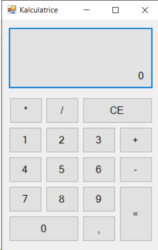

# Calculatrice Windows avec Interface Graphique

## 📌 Description
Ce projet est une **calculatrice de bureau** en C# développée avec Visual Studio Community. Elle permet d’effectuer des **opérations de base** à travers une interface utilisateur simple.

## 🚀 Fonctionnalités
- Addition, soustraction, multiplication, division
- Interface intuitive avec boutons
- Développement via Windows Forms

## 🛠 Technologies
- C#
- Visual Studio Community (WinForm)

## 📸 Aperçu
